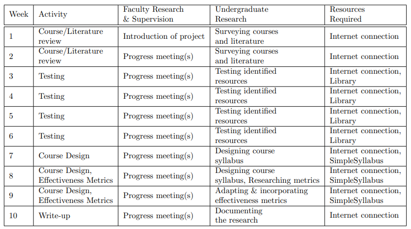

# Developing a Course on Competitive Programming - Summer Tehqiq Research Project 1

This is our Summer Tehqiq Research Project 1 (STRP-1); a 10 week long research project taken up in our second summers - after 4th Semester. 
The research assistants are <a href="https://www.linkedin.com/in/ali-muhammad-asad/">Ali Muhammad</a>, Areesha Amir, and Iqra Ahmed under the supervision of Dr. Waqar Saleem who is conducting the research project. 
The project, "Developing a Course on Competitive Programming" aims to develop a Computer Science course on competitive programming and propose metrics to measure its effectiveness. By the end of the research, a syllabus for the course was designed to be offered as an elective to the students of Habib University. The course has been approved and is taught from Spring 2024 onwards.
. 
Along with preparing teams for competitions like the ICPC, the course will help catalyse the already growing interest of competitive programming in the community by providing opportunities for the general student body to engage and improve their skills.

The tentative plan for the completion of this research project is as below. More details can be found in the [Project Proposal](tehqiq(2).pdf) document in the repository.

## Project Status: Complete

## Work Files

This section contains all (or most) of the files that were worked on.

### STRP Deliverables:

[Research Project Report](https://www.overleaf.com/4267976378nnrmttqqscrv)

[Research Poster](https://www.canva.com/design/DAFq2aXV1OY/NjOnEOaXlZeXjwEGP5r0Vg/edit)

[Progress Presentation](https://www.canva.com/design/DAFnjpwlteA/x0lp7vySU61PCfbmXLG6mg/edit)

### Collected Courses, Literature and Research Articles

[Existing Competitive Programming Courses](https://docs.google.com/document/d/1xm9YXKPlXZJ0LSYZ0fAHuwp9ms_S9QEOCdznbsoYGEY/edit?usp=sharing)

[Existing Research on Competitive Programming and its Courses](https://habibuniversity-my.sharepoint.com/:w:/g/personal/aa07613_st_habib_edu_pk/EV62gpDnw1xJkp1fOqyFPSoBeH4Snx1xGnjEUOSX3LeEyA?e=scclEq)

<!-- ### **Work Division:** Course Clusters for Analysis

[Course Clustering for Detailed Analysis](https://docs.google.com/document/d/1VEXhNUkPb8FuoSShD4B8OwtWA1zLCofRtXCpyg5FaMg/edit) -->

### Consolidated Spreadsheet related to the Course:

<!-- [Matrix of Courses and their included topics](https://docs.google.com/spreadsheets/d/18Y1a2Lqh2ExkO_bUVs73uWeeYMdFJZpE2WjkDyXXIuo/edit#gid=0)

[Weekly Topic Distribution of Courses that use Halim's Book](https://docs.google.com/spreadsheets/d/1aqbrIWdzCNVMtkUo6uJec_tKF3sNtme2RIIfEgnqngM/edit#gid=0) -->

<a href="https://docs.google.com/spreadsheets/d/1uqJqNLyfTbEdK6IgpEZiv_RYaCYTGqYsSvcy6FVWIR8/edit#gid=0" target="_blank">CS 3XX Competitive Programming - Consolidated Spreadsheet </a>

Contains:
<ul>
    <li>Course Topic for Common Topics</li>
    <li>Courses weekly division by different Universities</li>
    <li>Course Breakdown</li>
    <li>Grade Distribution</li>
</ul>

### Upcoming Course: Resources

[Teaching Resources for the Course Topics](https://docs.google.com/document/d/1-U2BWY-B9z0c8gM0FbUoimIr3emZQmz-4VxHS_J96yU/edit?usp=sharing)

<a href="https://docs.google.com/document/d/1r3yeoCZFF7--H6zFpF4T-XXOkLZ0eQN8q9IDIGyCfCs/edit" target="_blank">Course Weekly Problem Sets (google doc)</a> <a href="https://alimuhammadasad.github.io/Kattis-Problem-Sets/">Problem Sets (site)</a>

<a href="https://alimuhammadasad.github.io/Kattis-Solutions/">Problem Solutions</a> (Not All Included)

<a href="https://www.overleaf.com/3325868494wxzzbgnwdnkt"> Lecture Worksheets Overleaf Collection</a>

<!-- [Grade Distribution](https://docs.google.com/document/d/1tzGlru1aoUjiTFGoFF8RTW6V3Yvy7_TFGy2J80RMFPs/edit?usp=sharing)

[Tentative Course Structure and Schedule](https://docs.google.com/spreadsheets/d/1EMfG9Lw7aaS9gUtG4D-v90NHwlBMlnq_D25KyhGmiY0/edit#gid=0) -->

### Measuring Course Effectiveness

[Literature Review of existing methodologies](https://docs.google.com/document/d/1O_GYp8JlC_Aayzo-OROk1nkWFu-aruP7lhF0D99dFoM/edit)

<!-- ### Write-up

[Project Report](https://www.overleaf.com/project/64cb3d2208ed715ebfc76d1f)-->

## Meeting Minutes

This section contains a weekly summary of the discussion with the supervisor in each meeting.

Week 1: [Meeting Minutes - W1](https://docs.google.com/document/d/1JM9eXBHjkAAwSToezHaF5tmkGWU_8arA0I6BKL1jRuo/edit)

Week 2: [Meeting Minutes - W2](https://docs.google.com/document/d/1L5akC_Pf7xVepCY-4YkL-IcbAODTE7FLW5yaIC9vDeo/edit)

Week 3: [Meeting Minutes - W3](https://docs.google.com/document/d/10lq_SxRRZSfbPdTuO0_a8QorIOMh586NSZlHrZeim7s/edit?usp=sharing)

Week 4: [Meeting Minutes - W4](https://docs.google.com/document/d/138i9JJRml7n5XDeibWAsc7yUObR6N56Li7aWouvDyjc/edit)

Week 5: [Meeting Minutes - W5](https://docs.google.com/document/d/1lIKUDwvfF7BjdZQ7gnj25rrIrhXoGcat-i1SzpSqpWo/edit)

Week 6: [Meeting Minutes - W6](https://docs.google.com/document/d/1GlKCppg8ajLp9paazJ0QIXerP26lUUON1pkzaxxHqaA/edit?usp=sharing)

Week 7: [Meeting Minutes - W7](https://docs.google.com/document/d/1MGK9x0grLJymz479vsBWX2gdkrAkvaUEreFyuKn6BpQ/edit)

Week 9: [Meeting Minutes - W9](https://docs.google.com/document/d/1N_LDgn3D6mgCezJWGfN0_GSPQey4I9RxPZ-NMayW5zQ/edit)

Week 10: [Meeting Minutes - W10](https://docs.google.com/document/d/1ZIgDT3GI_vb6V06p0B4858luJDSiS3CE0rliMOjB1A8/edit?usp=sharing)
